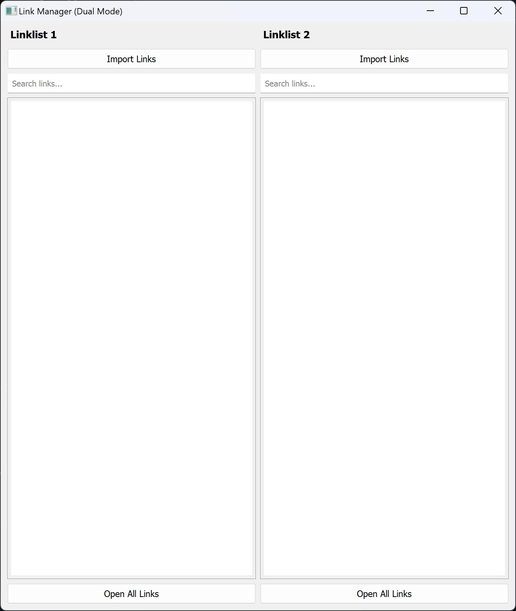

# 🌐 Link Manager

**Author:** Sebastian  
**Date:** 18. März 2025  

## 📌 Description  
**Link Manager** is a Python-based tool built with PyQt5 that imports and manages links from `.url` files stored in a folder.  
It extracts URLs, removes duplicates, sorts them alphabetically, and allows you to open them directly from the GUI.  

---

## 🚀 Features  
✅ Import `.url` files from a folder  
✅ Extracts URLs automatically  
✅ Removes duplicates and sorts links alphabetically  
✅ Open links with a double-click  
✅ Open all links at once  
✅ Filter links using a search bar  
✅ Saves and restores configuration automatically  

---

## 🛠️ Installation  
### 1. Clone the repository  
```bash
git clone https://github.com/Bildmaker/Link-Manager.git
```

## 📸 Screenshot  
  
